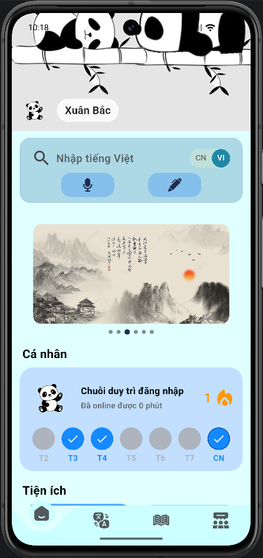
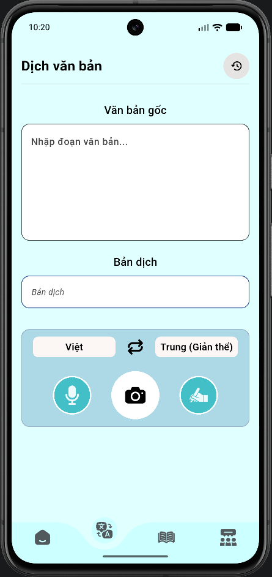
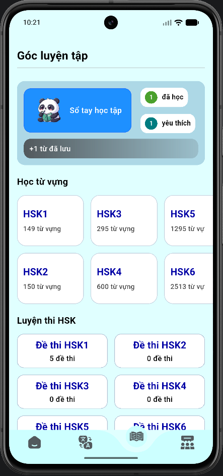
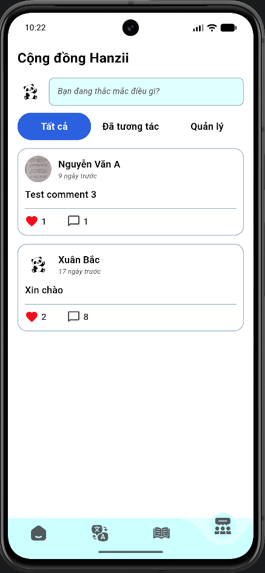

# Hanzii Learn App - Đồ án tốt nghiệp

## Mô tả dự án
Hanzii Learn App là ứng dụng học tiếng Trung được xây dựng bằng Flutter, tập trung vào trải nghiệm học từ vựng, luyện phát âm và hỗ trợ tra cứu thông minh.  

Dự án được phát triển trong khuôn khổ đồ án tốt nghiệp với mục tiêu:
- Xây dựng nền tảng học tiếng Trung trực quan, dễ sử dụng.
- Ứng dụng AI hỗ trợ học tập và luyện phát âm.
- Tích hợp OCR, nhận diện giọng nói và đồng bộ dữ liệu.
- Nghiên cứu mô hình ứng dụng Flutter đa nền tảng kết hợp Firebase.

Các đặc điểm chính:
- Xác thực người dùng và đồng bộ dữ liệu qua Firebase.
- Học từ vựng, quản lý dữ liệu cục bộ và lưu trạng thái học.
- Hỗ trợ nhận diện văn bản từ ảnh (OCR) và xử lý giọng nói.
- Tích hợp chuyển đổi văn bản, phát âm và các tiện ích luyện đọc.

---
## Demo giao diện
### Một số màn hình chính
| Trang chủ | Dịch thuật | Học tập | Cộng đồng |
|---|---|---|---|
|  |  |  |  |
---
## Tính năng chính
- Đăng nhập và xác thực người dùng bằng Firebase Authentication
- Học từ vựng tiếng Trung theo chủ đề / HSK
- Quản lý tiến trình và trạng thái học tập
- OCR nhận diện chữ Hán từ hình ảnh
- Speech-to-Text luyện phát âm tiếng Trung
- Text-to-Speech hỗ trợ phát âm từ vựng
- AI hỗ trợ giải nghĩa và học tập
- Community trao đổi và tương tác giữa người dùng
- Đồng bộ dữ liệu học tập qua Firebase

---
## Kiến trúc công nghệ
### Frontend
- Flutter
- Provider

### Backend & Cloud
- Firebase Authentication
- Cloud Firestore

### AI & Xử lý dữ liệu
- Google ML Kit OCR
- Gemini AI
- Speech-to-Text
- Text-to-Speech
- Translator API

### Local Storage
- SQLite
- SharedPreferences

---
## Hướng dẫn cài đặt
### 1) Yêu cầu môi trường
- Flutter SDK (khuyến nghị bản ổn định mới nhất, tương thích Dart SDK `^3.9.2`)
- Dart SDK (đi kèm Flutter)
- Android Studio hoặc Visual Studio Code (kèm extension Flutter/Dart)
- Thiết bị Android/iOS hoặc trình duyệt để chạy Flutter Web

### 2) Cài đặt dự án
```bash
git clone <repo-url>
cd DATN/hanziilearnapp
flutter pub get
```

### 3) Cấu hình biến môi trường (nếu cần)
Tạo hoặc cập nhật file `dart_defines.json` dựa trên mẫu:
```bash
copy dart_defines.example.json dart_defines.json
```
Sau đó điền các giá trị cấu hình phù hợp (API key, thông tin môi trường...).

---
## Cách dùng và ví dụ
### Chạy ứng dụng ở chế độ phát triển
```bash
cd hanziilearnapp
flutter run
```

### Chạy bản web
```bash
cd hanziilearnapp
flutter run -d chrome
```

### Build phát hành (ví dụ Android APK)
```bash
cd hanziilearnapp
flutter build apk --release
```

---
## Phần phụ thuộc
Các thư viện/package chính dùng để chạy dự án (hanziilearnapp/pubspec.yaml):

- Flutter SDK
- `provider`
- `firebase_core`, `cloud_firestore`, `firebase_auth`
- `flutter_screenutil`, `curved_navigation_bar`, `carousel_slider`, `cupertino_icons`
- `translator`, `lpinyin`
- `speech_to_text`, `flutter_tts`, `audioplayers`
- `google_generative_ai`
- `google_mlkit_text_recognition`, `image_picker`, `camera`, `image`
- `sqflite`, `path`, `path_provider`, `file_picker`, `shared_preferences`
- `http`

Dev dependencies:
- `flutter_test`
- `flutter_lints`

---
## Sơ đồ kiến trúc
```text
+---------------------------+
|      Flutter UI Layer     |
| Screens / Widgets / State |
+-------------+-------------+
              |
              v
+---------------------------+
|   Application Logic Layer |
| Provider / Services / AI  |
+------+------+-------------+
       |      |
       |      +----------------------+
       v                             v
+--------------+            +----------------------+
| Local Storage|            |   Cloud Services     |
| SQLite, Pref |            | Firebase Auth/Store  |
+------+-------+            +----------+-----------+
       |                               |
       v                               v
+--------------+             +---------------------+
| Device APIs  |             | External AI / APIs  |
| Camera, OCR, |             | Gemini, Translator  |
| TTS, STT     |             | HTTP integrations   |
+--------------+             +---------------------+
```

Mô tả nhanh:
- `UI Layer`: hiển thị giao diện học tập, điều hướng và nhận thao tác người dùng.
- `Application Logic Layer`: xử lý nghiệp vụ học tập, quản lý trạng thái, điều phối dữ liệu.
- `Local Storage`: lưu dữ liệu học cục bộ, lịch sử và cấu hình người dùng.
- `Cloud Services`: xác thực, đồng bộ và lưu trữ dữ liệu trên Firebase.
- `Device APIs` và `External AI/APIs`: tích hợp camera, OCR, giọng nói và các dịch vụ AI.

---
## Cấu trúc thư mục
```text
DATN/
|-- README.md
`-- hanziilearnapp/
    |-- lib/                       # Mã nguồn chính (UI, logic, services)
    |   |-- core/                  # Database, cấu hình lõi, tiện ích dùng chung
    |   `-- ...                    # Các module màn hình/chức năng khác
    |-- assets/                    # Ảnh, icon, tài nguyên tĩnh
    |-- test/                      # Unit test / widget test
    |-- android/                   # Cấu hình và mã native Android
    |-- ios/                       # Cấu hình và mã native iOS
    |-- web/                       # Cấu hình Flutter Web
    |-- windows/ linux/ macos/     # Desktop platform support
    |-- pubspec.yaml               # Khai báo dependencies và assets
    |-- pubspec.lock               # Khóa phiên bản package
    |-- firebase.json              # Cấu hình Firebase (nếu dùng)
    `-- run_admin_web.bat          # Script hỗ trợ chạy nhanh môi trường web
```

---
## Roadmap phát triển
### Giai đoạn 1 - Nền tảng hệ thống
- [x] Khởi tạo dự án Flutter đa nền tảng.
- [x] Thiết lập cấu trúc thư mục và luồng quản lý trạng thái.
- [x] Tích hợp cơ bản Firebase và dữ liệu cục bộ.

### Giai đoạn 2 - Tính năng học tập cốt lõi
- [x] Xây dựng màn hình học từ vựng và luyện tập.
- [x] Tích hợp phát âm (TTS), nhận diện giọng nói (STT).
- [x] Thêm OCR để trích xuất chữ từ hình ảnh.
- [x] Hoàn thiện màn hình cộng đồng Hanzii trao đổi, tương tác giữa các người dùng với nhau.

### Giai đoạn 3 - Mở rộng thông minh
- [x] Kết nối AI hỗ trợ học tập và giải nghĩa.
- [x] Tối ưu trải nghiệm người dùng, giao diện responsive.
- [ ] Hoàn thiện bộ test cho các luồng quan trọng (hiện mới có test cơ bản).

### Giai đoạn 4 - Hoàn thiện đồ án
- [x] Tối ưu hiệu năng và chất lượng mã nguồn.
- [x] Chuẩn hóa README kỹ thuật cơ bản (mô tả, cài đặt, kiến trúc, roadmap).
- [ ] Hoàn thiện bộ tài liệu kỹ thuật/báo cáo đầy đủ cho nghiệm thu.
- [ ] Đóng gói bản phát hành phục vụ nghiệm thu.

---
## Hạn chế hiện tại
- Chưa tối ưu hoàn toàn cho iOS
- Một số tính năng AI phụ thuộc API bên thứ ba
- Bộ test tự động còn hạn chế
- Chưa hỗ trợ offline sync đầy đủ
